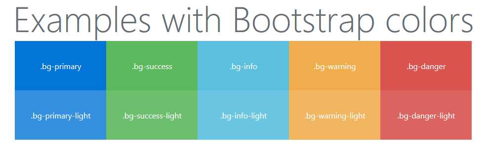

# lightBSColors
Light Bootstrap Colors

## How to use?
Just include one of these classes to your div.
```
bg-primary-light
bg-success-light
bg-info-light
bg-warning-light
bg-danger-light
```
Example:
```
<div class="bg-primary-light">This is div with lightened primary color.</div>
```

